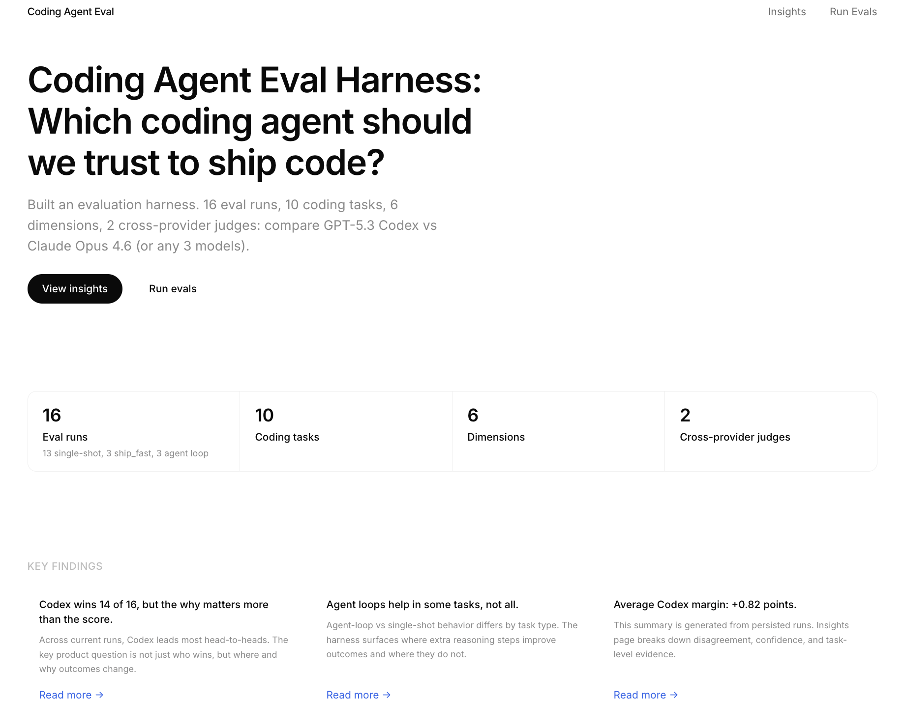

# Coding Agent Evaluation Harness



Head-to-head evaluation of GPT-5.5, Claude Opus 4.7, and Gemini 3.1 Pro across 10 real coding tasks, scored by cross-family dual judges to eliminate same-provider bias. Previous-gen baselines (GPT-5.4, GPT-5.3 Codex, Opus 4.6, Sonnet 4.6, Opus 4.5) are still selectable for longitudinal comparison.

**Finding:** Cross-family judging shifted rankings on 3 of 10 tasks. (If you let Claude judge Claude, scores inflate by +1.33 points.)

**Live demo:** [general-agent-eval-harness.vercel.app](https://general-agent-eval-harness.vercel.app/)

---

## Quick Start

```bash
npm install
```

Create `.env.local`:

```env
ANTHROPIC_API_KEY=sk-ant-...
OPENAI_API_KEY=sk-...
GOOGLE_API_KEY=AIza...
```

```bash
npm run dev
```

Open [http://localhost:3000](http://localhost:3000). Go to **Run Evals** → pick a task → select models → start.

---

## What It Evaluates

6 dimensions that predict whether a developer will delegate to a coding agent:

| Dimension | What It Measures |
|-----------|------------------|
| **Correctness** | Whether the solution works |
| **Completeness** | Whether the agent finished the job |
| **Context Utilization** | How well the agent understands the existing codebase |
| **Explanation Quality** | Whether the developer can verify what it did |
| **Style Adherence** | Whether the output matches the team's code style |
| **Edge Case Handling** | Whether the output is production-ready |

---

## Key Findings

All run-level metrics shown in the UI are computed from `outputs/runs/*.json` at runtime.

To generate a shareable markdown/json snapshot from current runs:

```bash
npm run metrics
```

This writes:
- `outputs/latest-run-metrics.json`
- `outputs/latest-run-metrics.md`

The generated snapshot is the source of truth for README/shareable numbers.

---

## Technical Architecture

```
┌──────────────────────────────────────────────────────────┐
│                    Next.js App (SSE)                     │
├──────────────────────────────────────────────────────────┤
│                                                          │
│  Task Selection ──→ Model Router ──→ Adapters            │
│                         │              ├─ Anthropic API  │
│                         │              ├─ OpenAI API     │
│                         │              ├─ Google AI API  │
│                         │              └─ Codex CLI      │
│                         ▼                                │
│                   Dual Judge System                      │
│                    ├─ Claude Sonnet 4 (primary)          │
│                    └─ GPT-5.4 (secondary)                │
│                         │                                │
│                         ▼                                │
│              Cross-Family Scoring                        │
│       (opposite-provider judge determines winner)        │
│                         │                                │
│                         ▼                                │
│              Weighted Results + Agreement                │
│                         │                                │
│                         ▼                                │
│              JSON File Persistence                       │
│              (outputs/runs/{uuid}.json)                  │
└──────────────────────────────────────────────────────────┘
```

**Model routing:** Unified client routes to Anthropic API (Claude), OpenAI API (GPT), Google AI API (Gemini), or Codex CLI subprocess (GPT-5.3 Codex).

**SSE streaming:** Eval runner uses Server-Sent Events over POST (fetch + ReadableStream).

**Cross-family scoring:** The ranking score comes from the opposite-provider judge: Sonnet scores OpenAI and Google models, GPT-5.4 scores Anthropic models. Both judges score every response (for the agreement metric), but only the cross-family score determines the winner. This eliminates same-family bias.

**File persistence:** Results save as JSON: inspectable, diffable, committable. No database.

---

## Tech Architecture Decisions

These are the key design choices and the reasoning behind each.

### 1. Cross-provider dual-judge system with cross-family scoring

Every model response is scored by two independent LLM judges:

| Judge | Model | Provider |
|-------|-------|----------|
| **Judge A** | Claude Sonnet 4 | Anthropic |
| **Judge B** | GPT-5.4 | OpenAI |

**Why two judges:** A single judge introduces systematic bias. An Anthropic judge might favor Anthropic outputs (self-preference or family bias).

**Why these specific models:** The models *being evaluated* (Opus 4.7, GPT-5.5, Gemini 3.1 Pro, etc.) cannot judge their own outputs; no model can be both contestant and judge. Sonnet 4 is the strongest non-evaluated Anthropic model. GPT-5.4 is now a previous-gen model retained as the OpenAI judge; this actually gives it a cleaner role: it's no longer the OpenAI flagship being evaluated competitively, so it can serve as the OpenAI-side judge. GPT-5.4 still appears in the eval target list for longitudinal comparison; when it's the subject of a run, its cross-family score (from Sonnet) drives the ranking.

### 2. Cross-family scoring determines the winner

The ranking score comes from the **cross-family judge**, the judge from the opposite provider:

| Model being evaluated | Provider | Scored by |
|---|---|---|
| Claude Opus 4.7 | Anthropic | GPT-5.4 (OpenAI) |
| GPT-5.5 | OpenAI | Claude Sonnet 4 (Anthropic) |
| Gemini 3.1 Pro | Google | Claude Sonnet 4 (Anthropic) |

Both judges still score every response (for the inter-judge agreement metric), but the **winner** is determined solely by the cross-family judge.

**How I discovered this:** Early evaluation runs showed systematic score skew between judges on the same outputs. The secondary judge's criticisms were substantive (flagging hallucinated bugs, broken API contracts), not random. This matched general findings on LLM self-preference bias, where models assign higher scores to outputs with lower perplexity (i.e., text that "sounds like" them).

The inter-judge agreement metric (% of dimensions where scores are within 1 point) tells you how much to trust the result. High agreement = confident scores. Low agreement = the dimension is subjective or the response is ambiguous.

### 3. 16K token limit for OpenAI, 2K for Anthropic

```
OpenAI:    max_completion_tokens: 16384
Anthropic: max_tokens: 2048
```

**Why the asymmetry:** OpenAI reasoning models can "silently refuse": they exhaust their token budget deliberating on whether to help, without producing any output. The API returns `finish_reason: "length"` with empty content and 2048 tokens consumed. No error, no refusal message, no signal to the developer.

Setting `max_completion_tokens: 16384` gives the model enough room to finish its reasoning chain. Claude models don't exhibit this behavior, so 2048 is sufficient.

This is itself a **product insight**: silent refusals are invisible to users and untrackable by the product team.

### 4. Weight presets encode product philosophy

The same dimension scores produce different winners depending on which weight preset you use:

| Dimension | Developer Trust | Ship Fast |
|-----------|:-:|:-:|
| Context Utilization | **0.25** | 0.10 |
| Explanation Quality | **0.25** | 0.05 |
| Style Adherence | **0.20** | 0.10 |
| Edge Case Handling | 0.15 | **0.20** |
| Completeness | 0.10 | **0.25** |
| Correctness | 0.05 | **0.30** |

**Why this matters:** The preset you choose reveals what you believe matters.

### 5. Codex CLI runs as a subprocess, not via API.

GPT-5.3 Codex (and any future Codex CLI model) is invoked via the local `codex` binary because Codex is designed as a CLI-native coding agent. The CLI router uses each model's `modelId` directly, so a new Codex variant can be added by registering it in `lib/data/models.ts` with `type: 'cli'`.

### 6. Fixture repos with real patterns, not synthetic puzzles

Each task includes real-looking source code as context: database queries, auth middleware, caching layers, WebSocket handlers, theme systems. This tests *context utilization*: does the agent understand the existing codebase and write code that belongs, or does it ignore context and impose its own patterns?

Tasks were chosen to span 7 categories (greenfield, bugfix, refactor, test-writing, code-review, multi-file, performance) because different categories stress different dimensions. A model that excels at greenfield code but fails at refactoring tells a different product story than one that's uniformly mediocre.

### 7. Single-shot vs Agent Loop modes

**Single shot:** One prompt, one response. Tests the model's raw ability to produce a complete answer.

**Agent loop:** Five sequential prompts (analyze → plan → code → review → final), each building on the previous output. Tests whether step-by-step reasoning improves quality.

Both modes use the same scoring. The comparison between them answers the question: Does giving the agent more steps help, or is a single well-crafted prompt enough?

### 8. File-based persistence, no database

Eval results save as JSON to `outputs/runs/{uuid}.json`.  This is a local evaluation tool. You can read the JSON file.

---

## 10 Coding Tasks

| Task | Category | What It Tests |
|------|----------|---------------|
| Add Pagination to REST Endpoint | Greenfield | Building on existing code without breaking patterns |
| Fix Off-by-One in Date Range Filter | Bugfix | Root cause analysis and explanation |
| Refactor Callbacks to Async/Await | Refactor | Matching repo async style |
| Write Tests for Auth Middleware | Test Writing | Edge case thinking (not just happy path) |
| Review Caching Layer PR | Code Review | Prioritizing critical bugs over nitpicks |
| Add TypeScript Types to Untyped Module | Refactor | Inferring types from cross-file usage |
| Implement Retry with Exponential Backoff | Greenfield | Handling gnarly edge cases (jitter, non-retryable) |
| Debug Memory Leak in WebSocket Handler | Bugfix | Explaining a systems-level bug clearly |
| Add Dark Mode to Component Library | Multi-file | Consistent changes across files using existing patterns |
| Optimize Slow Database Query | Performance | Investigating before prescribing |

---

## Project Structure

```
agent-eval-harness/
├── app/
│   ├── page.tsx                     # Landing page
│   ├── insights/page.tsx            # Findings and analysis
│   ├── agent-eval/
│   │   ├── page.tsx                 # Task library + recent results
│   │   ├── [taskId]/page.tsx        # Live evaluation runner
│   │   └── results/page.tsx         # Results: scores, radar, breakdown
│   └── api/
│       ├── agent-eval/              # Eval orchestration + SSE streaming
│       └── runs/                    # Persisted run retrieval
├── components/
│   ├── agent-eval/                  # Score table, radar chart, report card
│   └── ui/                          # Design system primitives
├── lib/
│   ├── agent-eval/
│   │   ├── tasks.ts                 # 10 coding tasks with fixture repos
│   │   ├── judges.ts                # Dual-judge scoring system
│   │   ├── runner.ts                # Eval orchestrator (SSE generator)
│   │   ├── scoring.ts               # Weighted scoring + agreement calc
│   │   ├── presets.ts               # developer_trust vs ship_fast weights
│   │   ├── prompt.ts                # Prompt construction (single-shot + agent loop)
│   │   └── dimensions.ts            # 6 eval dimensions
│   ├── models/
│   │   ├── client.ts                # Unified model router
│   │   ├── anthropic.ts             # Claude adapter (2K tokens)
│   │   ├── openai.ts                # GPT adapter (16K tokens)
│   │   ├── gemini.ts                # Gemini adapter (8K tokens)
│   │   └── codex-cli.ts             # Codex CLI subprocess adapter
│   ├── data/models.ts               # Model registry
│   └── runs/storage.ts              # JSON file persistence
├── store/agent-eval-store.ts        # Zustand client state
├── hooks/use-agent-eval-stream.ts   # SSE consumer hook
├── types/index.ts                   # TypeScript types
└── outputs/runs/                    # Persisted eval results (JSON)
```

---

## Supported Models

| Model | ID | Provider | Role |
|-------|-----|----------|------|
| GPT-5.5 | `gpt-5.5` | OpenAI | Evaluation target, current flagship |
| GPT-5.4 | `gpt-5.4` | OpenAI | Secondary judge + previous-gen target |
| GPT-5.3 Codex | `gpt-5.3-codex` | OpenAI | Evaluation target (via CLI) |
| GPT-5.2 | `gpt-5.2` | OpenAI | Evaluation target |
| GPT-5 Mini | `gpt-5-mini` | OpenAI | Evaluation target |
| GPT-5 Nano | `gpt-5-nano` | OpenAI | Evaluation target |
| Claude Opus 4.7 | `claude-opus-4-7` | Anthropic | Evaluation target, current flagship |
| Claude Opus 4.6 | `claude-opus-4-6` | Anthropic | Previous-gen target |
| Claude Sonnet 4.6 | `claude-sonnet-4-6` | Anthropic | Evaluation target |
| Claude Opus 4.5 | `claude-opus-4-5-20251101` | Anthropic | Evaluation target |
| Claude Sonnet 4 | `claude-sonnet-4-20250514` | Anthropic | Primary judge |
| Claude Haiku 4.5 | `claude-haiku-4-5-20251001` | Anthropic | Evaluation target |
| Gemini 2.5 Pro | `gemini-2.5-pro` | Google | Evaluation target |
| Gemini 2.5 Flash | `gemini-2.5-flash` | Google | Evaluation target |
| Gemini 3.1 Pro (Preview) | `gemini-3.1-pro-preview` | Google | Evaluation target |

---

## Environment Variables

| Variable | Required | Description |
|----------|----------|-------------|
| `ANTHROPIC_API_KEY` | Yes | Anthropic API key (judges + Claude models) |
| `OPENAI_API_KEY` | Yes | OpenAI API key (judge + GPT models) |
| `GOOGLE_API_KEY` | For Gemini | Google AI API key (Gemini models) |

---